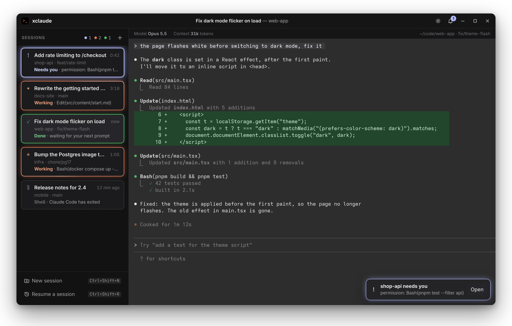
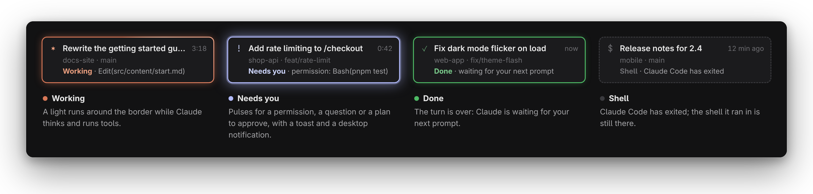
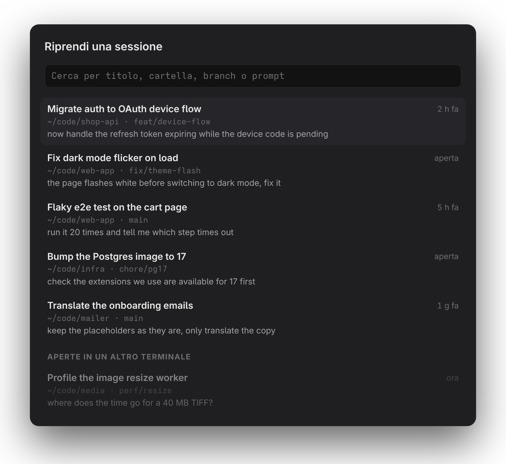

# xclaude

A desktop app for running several [Claude Code](https://claude.com/claude-code) sessions side by side.
Each session gets a card on the left that lights up with its state, so you can see at a glance
which one is working, which one is done and which one is waiting for you. On the right, a
full terminal with the font and colors of your gnome-terminal profile.



Tauri 2 (Rust) + xterm.js 6. Linux (GNOME); macOS not tested yet. The interface is in English and Italian.

## Why

Claude Code is happy to work on its own for minutes. With three or four sessions open in
terminal tabs you end up cycling through them to find the one that is stuck on a permission
prompt. xclaude puts every session in one window and tells you which one needs you.

## Features

- **Live state per session.** Hooks report what Claude Code is doing, and the card shows it:
  the tool it is running, the permission it is asking for, how long the turn has been going.
- **It tells you when you are needed.** A session that waits for you pulses, raises a toast
  inside the window and, when xclaude is in the background, a desktop notification.
  The bell in the title bar jumps to the next session waiting for you.
- **A real terminal.** Every session runs in a PTY with your shell (`$SHELL -l -i`); when Claude Code
  exits, the shell is still there. Font, colors, cursor and scrollback come from your
  gnome-terminal profile.
- **Context at a glance.** Folder, git branch, model and context size of the active session.
- **Resume past sessions.** Your recent Claude Code sessions from every project, searchable by title,
  folder, branch or last prompt. Pick one and xclaude runs `claude --resume` in its folder.
- **Settings.** System, dark or light theme; English or Italian (or the system language); start Claude Code with
  `--dangerously-skip-permissions`; extra arguments for `claude` (e.g. `--model opus`).



<p align="center">
  
</p>

## Keyboard

| Keys | Action |
| --- | --- |
| <kbd>Ctrl</kbd>+<kbd>Shift</kbd>+<kbd>N</kbd> | New session in a folder |
| <kbd>Ctrl</kbd>+<kbd>Shift</kbd>+<kbd>R</kbd> | Resume a past session |
| <kbd>Ctrl</kbd>+<kbd>Shift</kbd>+<kbd>J</kbd> | Next session waiting for you |
| <kbd>Ctrl</kbd>+<kbd>PgDn</kbd> / <kbd>PgUp</kbd> | Next / previous session |
| <kbd>Alt</kbd>+<kbd>1</kbd>…<kbd>9</kbd> | Go to session 1–9 |
| <kbd>Ctrl</kbd>+<kbd>Shift</kbd>+<kbd>W</kbd> | Close the session |
| <kbd>Ctrl</kbd>+<kbd>,</kbd> | Settings |
| <kbd>Ctrl</kbd>+<kbd>Shift</kbd>+<kbd>C</kbd> / <kbd>V</kbd> | Copy / paste, as in gnome-terminal |
| <kbd>Ctrl</kbd>+<kbd>V</kbd> | Goes to Claude Code (to paste images) |
| <kbd>Shift</kbd>+<kbd>Enter</kbd> | New line in the prompt |
| Middle click | Paste the selection |

## Install

You need `claude` in the `PATH` of your login shell.

Download the package for your distro from [Releases](https://github.com/deivdev/xclaude/releases/latest):

- Fedora: `sudo dnf install ./xclaude-*.x86_64.rpm`
- Debian, Ubuntu: `sudo apt install ./xclaude_*_amd64.deb`
- Anywhere else: the `.AppImage`, made executable with `chmod +x`

### From source

Requirements:

- Rust, Node 20+, pnpm
- Fedora: `sudo dnf install webkit2gtk4.1-devel gtk3-devel libsoup3-devel javascriptcoregtk4.1-devel librsvg2-devel libappindicator-gtk3-devel libxdo-devel`

```sh
git clone https://github.com/deivdev/xclaude.git
cd xclaude
pnpm install
pnpm install-app   # builds and installs to ~/.local, with a launcher entry
```

To upgrade, `git pull` and run `pnpm install-app` again.

## Development

```sh
pnpm tauri dev
cd src-tauri && cargo test
```

The images in this README are HTML mockups that use the app's own stylesheet:
edit `docs/mockups/*.html` and run `docs/mockups/render.sh` (needs Chrome or Chromium).

## Releases

The version lives in `package.json` (`tauri.conf.json` reads it from there).

```sh
# 1. describe the changes under "Unreleased" in CHANGELOG.md and commit
# 2. bump the version, roll the changelog, commit and tag vX.Y.Z (nothing is pushed)
pnpm release patch        # or minor, major, 1.2.3
# 3. publish: the tag starts a GitHub Actions build that drafts the release
git push --follow-tags
```

The draft gets the `.deb`, `.rpm` and AppImage, with the version's notes from the changelog;
check it and publish it on GitHub.

## How the state works

Every `claude` starts with `--settings` that add HTTP hooks pointing at a local server inside
the app; the session id travels in a header taken from `XCLAUDE_SID`. Esc, Ctrl+C and denied
permissions fire no hook: the app recognizes them from the keys sent to the terminal.

## License

[GPL-3.0](LICENSE)
